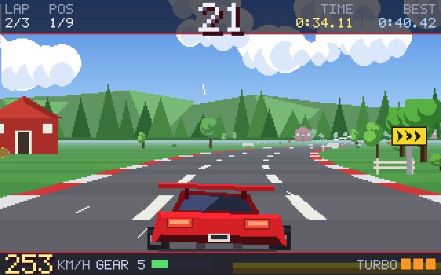
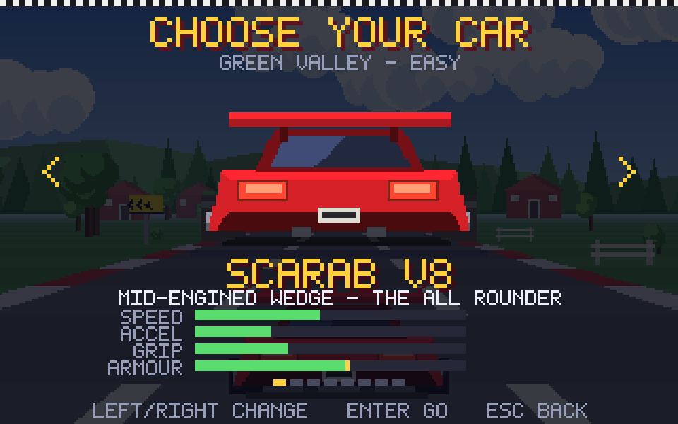
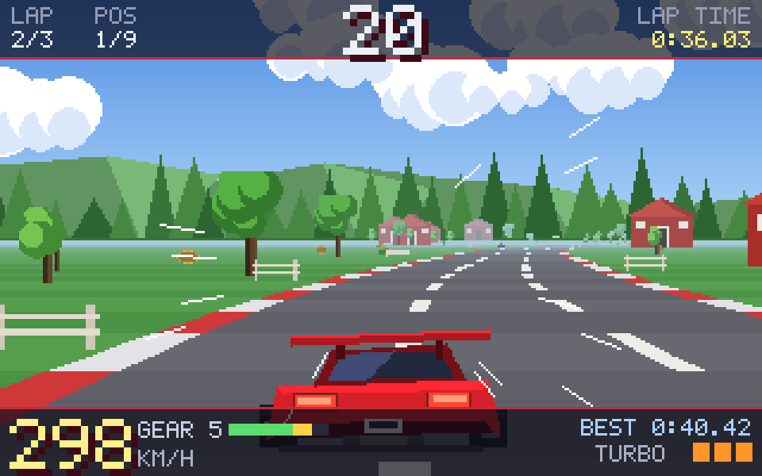
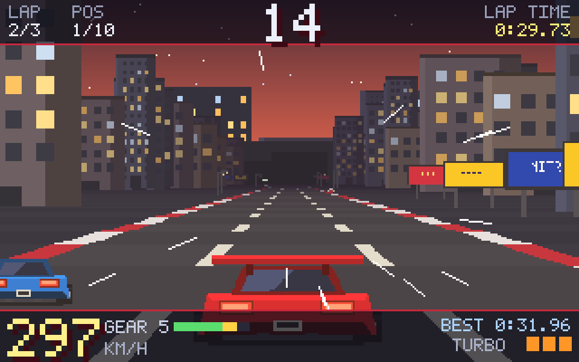
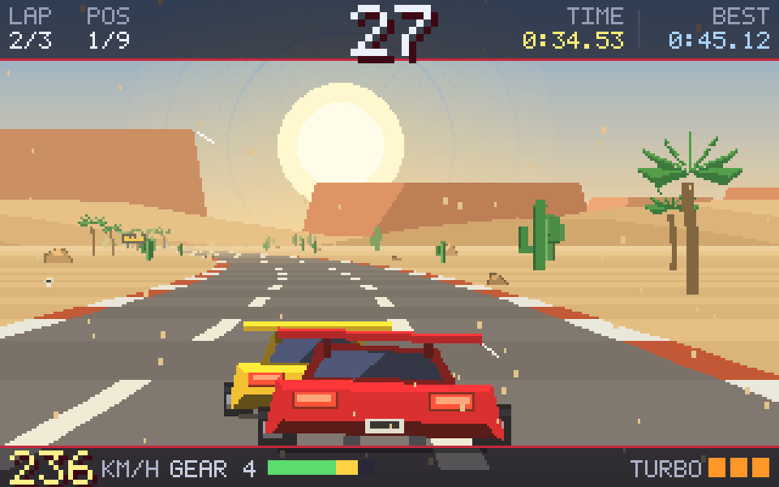
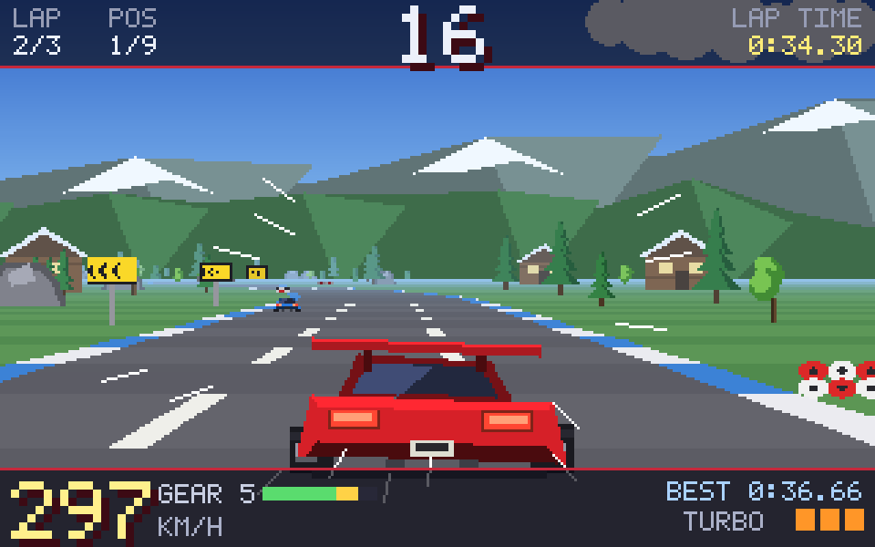
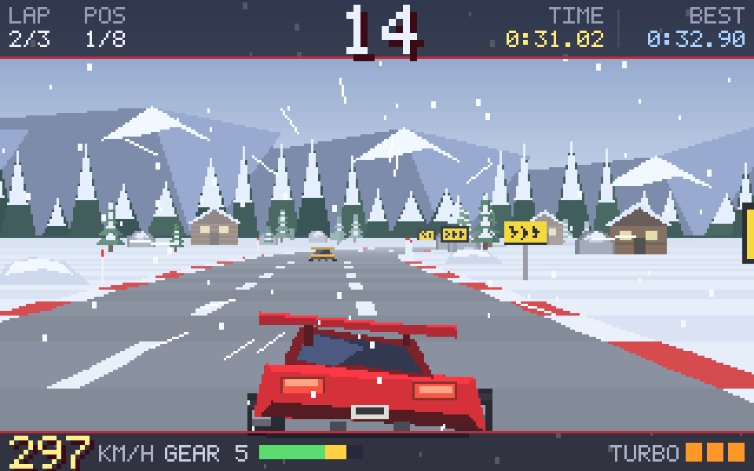
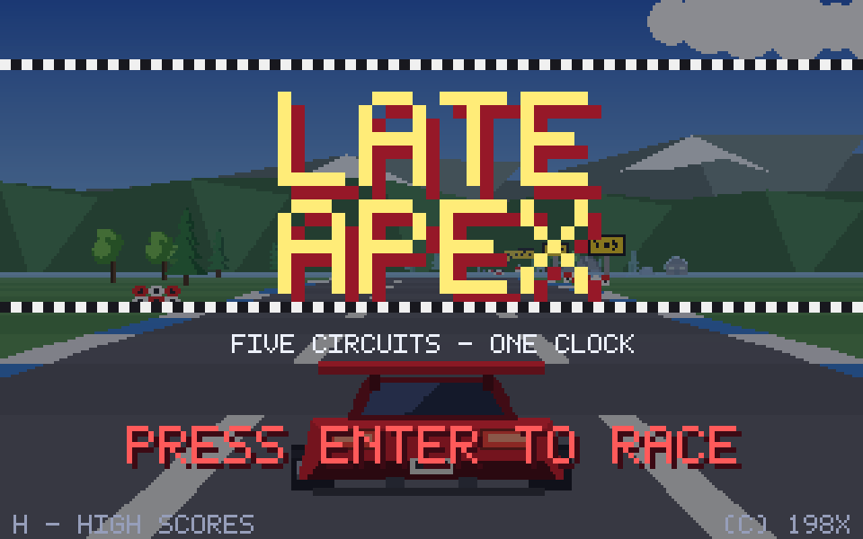
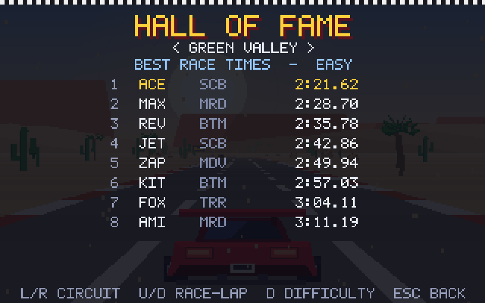
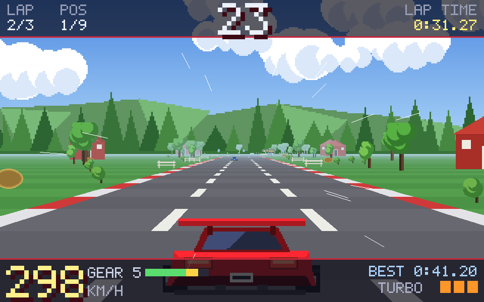

# Late Apex

A retro pseudo-3D arcade racer for macOS, in the spirit of the 16-bit
beat-the-clock racers: five circuits, five cars, three laps, and a countdown
that only a clean lap will survive.



Every pixel and every note is generated by code in this repository — the
sprites, the parallax backdrops, the six chiptune tracks, the engine loops and
all the sound effects. There is no external art or audio anywhere in the
project.

## Running it

```bash
./run.sh
```

The first run creates a virtualenv, installs `pygame-ce` and `numpy`, generates
any missing assets and starts the game. Python 3.9+ and macOS are all you need.

## The name

The title is the technique the physics rewards. Sideways force grows with the
**square** of your speed while steering authority only grows linearly, so a
fast corner cannot be taken flat. Brake, turn in late, get the car straight
early, and use the power sooner — a late apex is quicker than a pretty one.

## The garage



Five cars, and the choice genuinely matters — the heavy ones need braking
points a good deal earlier, and no single car is best everywhere.

None of them is a real vehicle. Car names, badges *and body shapes* are all
separately protected, so these are original designs rather than filed-off
copies of anything.

<br clear="right">

| Car | Character |
| --- | --- |
| **Scarab V8** | Mid-engined wedge. The reference car — balanced everywhere |
| **Meridian GT** | Big grand tourer. Highest top speed, lazy turn-in, wants long straights |
| **Bantam 16V** | Light and eager. Slowest flat out, superb through the tight stuff |
| **Medivac 90** | An ambulance. Sirens on: the field pulls over for you |
| **Tourer 800** | Eight seats of defiance. Heavy, slow, shrugs off contact |

Every car can finish every circuit — that is
[enforced by the test suite](tests/test_balance.py), so the slow ones are a
choice rather than a trap.

## The circuits

| | |
|:---:|:---:|
| **Green Valley** — rolling hills, long straights | **Neon City** — downtown at dusk, tight and walled in |
|  |  |
| **Dust Highway** — flat out across the badlands | **Alpine Crest** — high peaks and huge crests |
|  |  |
| **Frost Pass** — ice, snow and no room for error | |
|  | |

| Circuit | Difficulty | Character |
| --- | --- | --- |
| Green Valley | ★ | Fast and open, a good place to learn the physics |
| Neon City | ★★ | Short lap, walls close in, punishes the heavy cars |
| Dust Highway | ★★ | Long straights, big sweepers, top speed matters |
| Alpine Crest | ★★★ | Crests that unload the car mid-corner |
| Frost Pass | ★★★★ | Low grip — everything happens earlier than you expect |

## Controls

| Key | Action |
| --- | --- |
| `↑` / `W` | Accelerate |
| `↓` / `S` | Brake |
| `←` `→` | Steer |
| `Space` | Turbo boost — three per race |
| `P` / `Esc` | Pause |
| `Enter` | Confirm |
| `M` | Music on/off |
| `F1` | Fullscreen |
| `F3` | Frame counter |

## How a race works



Three laps against a running countdown. Cross the line and the clock is topped
up by that circuit's lap bonus; let it reach zero and the race ends wherever
you happen to be. The limits are tuned so a clean lap survives with a few
seconds in hand and a scruffy one does not.

Every race starts from a standstill. Blipping the throttle on the line revs the
engine, but it cannot build road speed before the lights go out.

Grass scrubs speed off, scenery stops you dead, and Frost Pass gives you
noticeably less grip to work with.

<br clear="right">

## High scores



Best race times and best lap times are kept per circuit, eight entries each,
under a three-character name entered the old way — arrows to pick a letter, or
just type it. The table also records which car set the time.

They live in `~/Library/Application Support/LateApex/scores.json`.

<br clear="right">

## Building an app bundle

```bash
./tools/make_app.sh          # a launcher for this machine
./tools/make_standalone.sh   # a self-contained app you can send to someone
```

The first builds a small `Late Apex.app` whose executable is a universal
(arm64 + x86_64) binary compiled from
[`tools/launcher/launcher.c`](tools/launcher/launcher.c). It needs the sources
and the virtualenv beside it, so it is only useful locally — but it reports as
Universal in Finder and starts natively on Apple Silicon. A bundle whose
executable is a shell script has no Mach-O header for Finder to read an
architecture from, which is why such apps get labelled "Intel" even when
everything they run is native.

The second produces `dist/Late Apex.app` (~53 MB, arm64) with the Python
runtime, pygame and every asset embedded, for someone with nothing installed.
Zip it with `ditto`, which preserves the bundle and its signature:

```bash
ditto -c -k --keepParent "dist/Late Apex.app" ~/Desktop/LateApex.zip
```

Prebuilt copies are on the [releases page](../../releases).

### Getting past Gatekeeper

The app is ad-hoc signed but not notarized, so the first launch of a downloaded
copy is blocked with *"Apple could not verify 'Late Apex' is free of malware"*.

**On macOS 15 (Sequoia) and later the old right-click → Open trick no longer
works.** Either strip the quarantine flag the browser attached:

```bash
xattr -dr com.apple.quarantine "$HOME/Downloads/Late Apex.app"
```

…or open it once, click **Done**, then go to **System Settings → Privacy &
Security**, find *"Late Apex" was blocked to protect your Mac* and click **Open
Anyway**. That button only appears after a blocked attempt and expires about an
hour later.

On macOS 14 and earlier, right-clicking the app and choosing **Open** is enough.

Building it yourself with `./tools/make_standalone.sh` avoids this entirely —
locally built apps are never quarantined.

## Generated assets

```bash
.venv/bin/python tools/gen_assets.py    # every sprite and backdrop
.venv/bin/python tools/gen_music.py     # tunes, engine loops, effects
.venv/bin/python tools/gen_icon.py      # the app icon
.venv/bin/python tools/capture.py       # the screenshots and GIF in this file
```

All of them are deterministic, so changing a colour or a melody and re-running
gives a consistent set. `gen_music.py` synthesises the music from pulse,
triangle and saw oscillators through a small bass/arpeggio/drum sequencer, and
writes sixteen seamless engine loops that the game crossfades between so the
engine note follows the revs.

The game renders internally at 320×200 and scales the whole frame up, which is
what keeps the pixels chunky at any window size.

## Hi-res mode

```bash
./run.sh --hires        # world at 960x600
./run.sh --scale 2      # or 1-4; 1 is the default
```



The road renderer was already resolution-independent — it takes the frame size
as a parameter — so this is mostly a matter of what *isn't*. The world renders
at `320x200 * scale`, while the HUD and menus stay on the 320x200 grid on their
own layer and are scaled up as one piece, which keeps the bitmap font exactly
square instead of re-rasterising it at an awkward size. Sprites are still drawn
at 1x, so you get a crisp road under chunky pixel art — roughly what the Super
Scaler arcade boards looked like.

It costs about 626 fps at 960x600 versus ~1400 at 320x200 — either way there is
an order of magnitude of headroom over 60fps. The window stays the same size; only
the detail in it changes. Default is unchanged at 320x200.

## Tests

```bash
./test.sh                  # everything, about 8 seconds
./test.sh geometry rules   # just those suites
```

| Suite | Checks |
| --- | --- |
| `geometry` | Sprite anchoring, nothing collidable on the racing line, each lap joining back up |
| `rules` | Standing start, lap counting and time bonuses, turbo limits, the off-road penalty, per-car handling and the ambulance siren |
| `render` | All five circuits draw, frames are not blank, speed leaves 60fps headroom |
| `ui` | Title → circuits → garage → race → pause → results → name entry → score table, and that scores persist |
| `balance` | An autopilot races every car on every circuit; all 25 combinations must finish with time in hand, and a sloppy run must still be able to fail |
| `hires` | The optional hi-res mode, in a subprocess since the scale is fixed at import time: default stays 320x200, the HUD keeps its own grid, the window does not change size |

The suite runs headless and writes contact sheets to `tests/output/`, so a run
can be eyeballed as well as asserted on. It redirects the high score file into
a temp directory via `LATE_APEX_DATA_DIR`, so testing never touches real
scores.

## Layout

```
main.py               entry point
game/
  app.py              screens, menus, garage, name entry, attract-mode demo
  race.py             car physics, rival AI, weather, HUD
  render.py           the pseudo-3D road renderer
  track.py            road geometry and the five themed circuits
  cars.py             the garage and its handling numbers
  config.py           render scale, read once at import time
  autopilot.py        the driver used by the demo, the tests and capture
  audio.py            music, engine crossfades, effects
  scores.py           persistent high score tables
  pixelfont.py        hand-built 5x7 bitmap font
tools/
  gen_assets.py       draws every sprite and backdrop
  gen_music.py        synthesises the tunes, engine loops and effects
  gen_icon.py         draws the app icon
  capture.py          screenshots and the GIF for this README
  make_app.sh         builds a local launcher app
  make_standalone.sh  builds a self-contained app for sharing
  launcher/           native universal launcher source
tests/                headless suite, run with ./test.sh
assets/               the generated PNGs and WAVs
```

## Licence

MIT — see [LICENSE](LICENSE).

The game depends on [pygame-ce](https://pyga.me/) (LGPL 2.1) and, for asset
generation only, [NumPy](https://numpy.org/) (BSD). The standalone bundle is
built with [PyInstaller](https://pyinstaller.org/), whose licence explicitly
permits distributing bundled applications under any terms.

## Acknowledgement

This game was written by [Claude](https://claude.com/claude-code) (Anthropic's
Claude Code) — design, code, pixel art, music and all — from a short prompt
asking for a retro racer in the style of the 16-bit classics.
